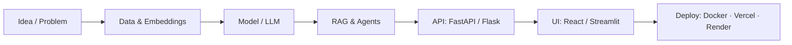
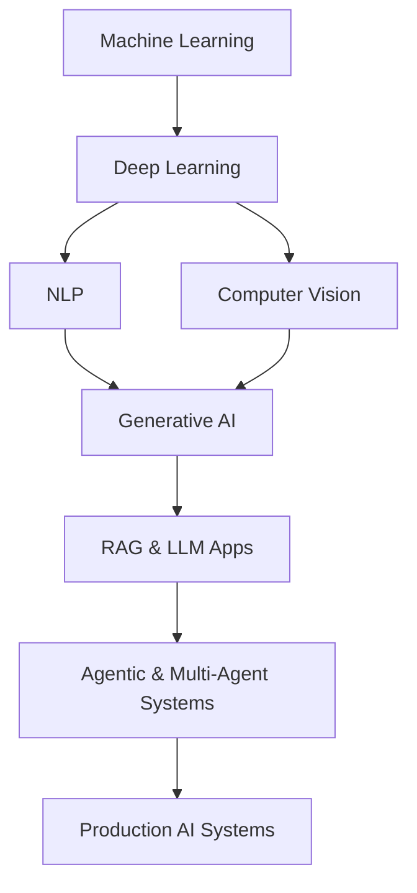

# 👋 Hi, I'm R Sri Charan Rao

### AI/ML Engineer · Generative AI · Agentic AI · RAG

 

---

## 🧑‍💻 About Me

I'm an **Artificial Intelligence & Machine Learning engineering student** who likes turning ideas into **working, deployable AI systems** — not just notebooks. I enjoy the full journey: experimenting with models, wiring them to APIs and databases, and shipping them.

- 🔭 **Currently exploring:** Generative AI, RAG, multi-agent systems, quantum computing
- 🛠️ **Currently building:** LLM-powered apps with FastAPI, React and vector search
- 🌱 **Currently learning:** production-grade AI engineering (evaluation, deployment, reliability)
- 🤝 **Open to:** collaborations, internships and hackathons in AI/ML
- 💬 **Ask me about:** RAG pipelines, agentic workflows, NLP, computer vision

---

## 🧰 Tech Stack

**Languages**

**ML / DL**

**Generative AI & NLP**

**Backend, Frontend & Data**

**DevOps & Tools**

<b>🧠 AI engineering concepts I work with</b>

 

`LLM Applications` · `Multi-Agent Systems` · `Embeddings` · `Semantic Search` · `Prompt Engineering` · `Reflection` · `AI Workflows` · `Sentence Transformers` · `NLTK`

---

## 🚀 Featured Projects

| Project | What it does | Tech | Links |
|---|---|---|---|
| 🧮 **Mini Meta-Agent** | Multi-agent mathematical reasoning with automated debate between agents | `Python` `RAG` `FAISS` `LLMs` | [Repo](https://github.com/srichu05/META-AGENT) |
| 📚 **Doc2Learn-AI** | Turns documents into an intelligent learning experience | `FastAPI` `OCR` `RAG` `PostgreSQL` | [Repo](https://github.com/YOUR_GITHUB_USERNAME/REPO_NAME) · [Demo](#) |
| 🏛️ **AI Museum** | Recognises museum artifacts and assists visitors with multimodal AI | `CNN` `TensorFlow` `Multimodal AI` | [Repo](https://github.com/YOUR_GITHUB_USERNAME/REPO_NAME) |
| 💸 **RecoverAI** | Autonomous revenue recovery and decision workflow | `Agentic AI` `Flask` `React` `Groq` | [Repo](https://github.com/srichu05/RecoverAI) · [Demo](#) |
| 🧑‍💼 **AI-HireSphere** | Resume analysis and candidate matching | `FastAPI` `React` `Gemini` | [Repo](https://github.com/YOUR_GITHUB_USERNAME/REPO_NAME) · [Demo](#) |
| 🌍 **Geospatial Risk Mapping** | Localised environmental risk analysis from satellite data | `ML` `Satellite Data` `Geospatial AI` | [Repo](https://github.com/YOUR_GITHUB_USERNAME/REPO_NAME) |
| ⚛️ **Quantum Computing** | Quantum programming and algorithm implementations | `Python` `Quantum Computing` | [Repo](https://github.com/YOUR_GITHUB_USERNAME/REPO_NAME) |

> 💡 Tip: pin your 6 best repos on your profile so visitors see them first.

---

## 🏗️ How I Build AI Systems

---

## 🗺️ Learning Roadmap

---

## 📊 GitHub Stats

 

 

> 🌗 The `transparent` theme can be hard to read in one of GitHub's light/dark modes. If text looks faint, switch to `theme=tokyonight` (or `dark`) for a consistent look.

---

## 🤝 Let's Connect

I'm always happy to talk about AI/ML, share ideas, or collaborate on projects.

⭐ *If you like something here, a star on the repo means a lot!* ⭐

